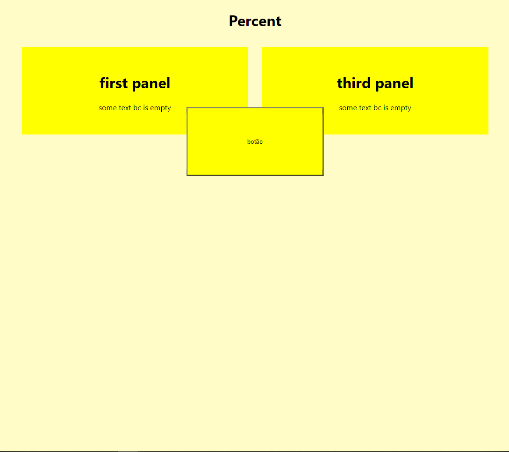

<h1 align='center'>responsividade fluída</h1>

<h2 align='center'>
    exemplo
</h2>



<h2 align='center'>
o que é?
</h2>

responsividade fluída consiste em usar principalmente porcentagem na margem para alinhar (e coisas do gênero)

no entato, a margem é aplicada no inicio do objeto, fazendo ele ficar torto

para concertar, utilizamos transform e translate

<h3 align='center'>
exemplo:
</h3>

```css
button {
    margin-top: 50%;
    margin-left: 50%;
    translate: transform(-50%, -50%)
}
```

<h2 align='center'>
considerações
</h2>

vc pode aplicar propriedades especificas

```css
button {
    margin-left: 50%;
    translate: transformX(-50%)
}
```