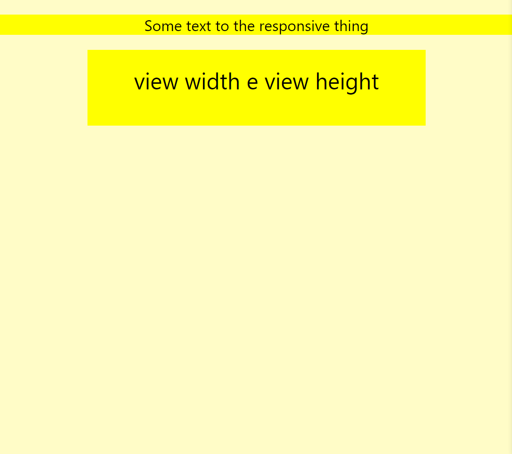

<h1 align='center'>responsividade fluída</h1>

<h2 align='center'>
    exemplo:
</h2>



<h2 align='center'>
o que é?
</h2>

CSS disponibiliza algumas medidas que se adaptam as configurações do usuário
como o vw (view width), vh (view height) e o rem (tamanho da fonte de acordo com a raiz, geralmente 16px)

<h3 align='center'>
exemplo:
</h3>

```css
p{
    font-size: 2rem; /*16px do browser * 2 = 32px*/
}
/*------------------*/
html {
    font-size: 10px;
}
p {
    font-size: 3rem; /*30px*/
}
```