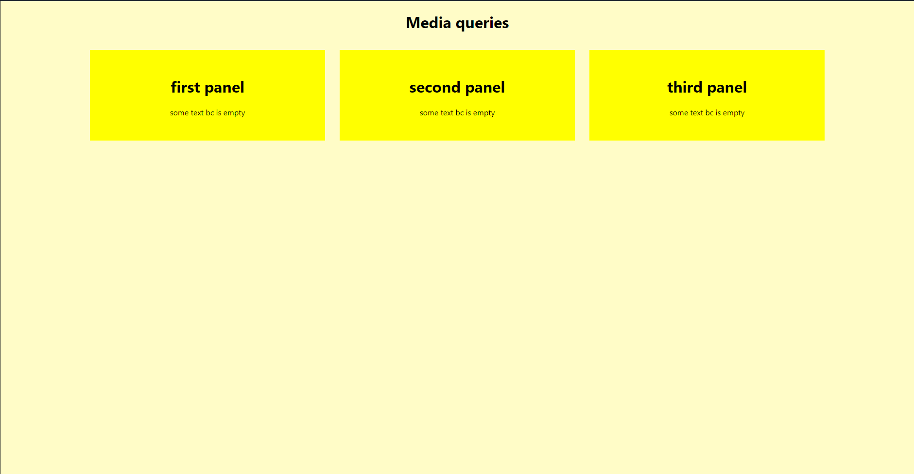
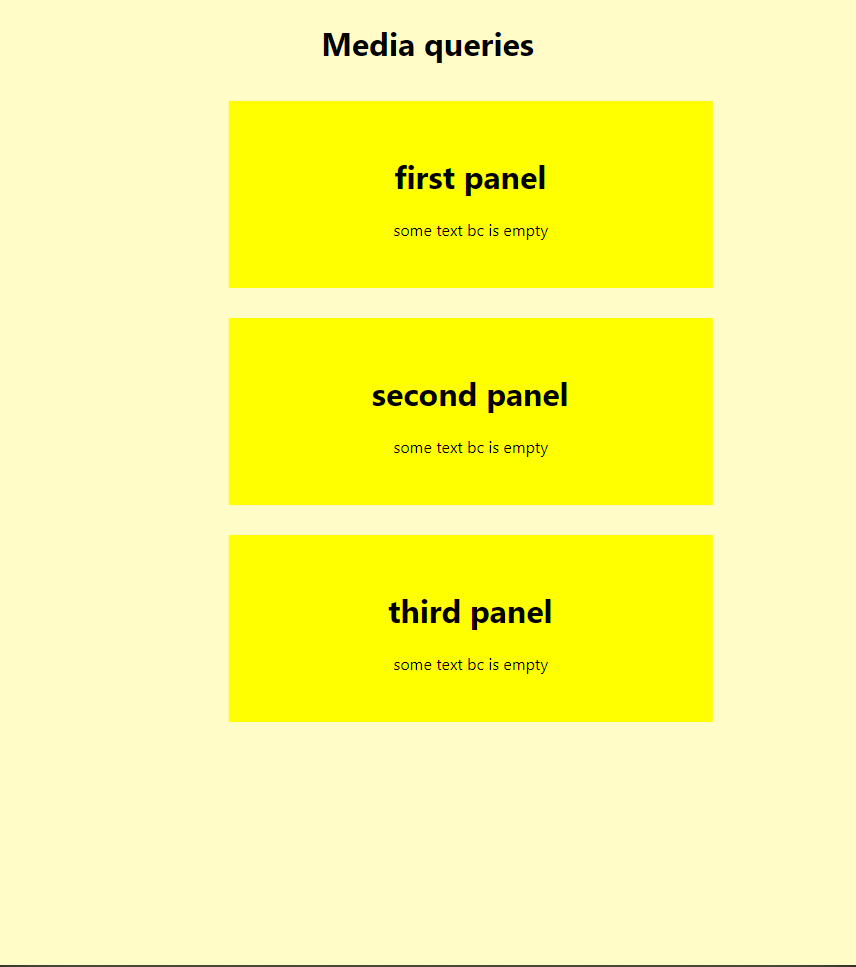

<h1 align='center'>Media Queries</h1>

<h2 align='center'>
    exemplo
</h2>

>fullscreen


>responsive


<h2 align='center'>
o que são?
</h2>

funcionam como se fossem 'ifs'
no exemplo utilizo apenas uma condição
```css
/*sintaxe basica*/
/*chama    condição*/
@media (max-width: 900px) {
    header {
        justify-content: center;
    }
    /*refazer os conteudos*/
}

/*tambem pode receber um mediatype*/
@media only screen and (max-height: 1200px) {
    [...]
}
/*todos que tem:*/
/*not dispara se nao for uma tela ou dispositivo para deficientes visuais*/
@media not | only screen | speech and (condition1 and | or | not condition2) {
    [...]
}
```

<h2 align='center'>
considerações
</h2>

no css, eu estou utilizando transform e translate, se quiser saber um pouco mais, de uma checada no arquivo 'percent'